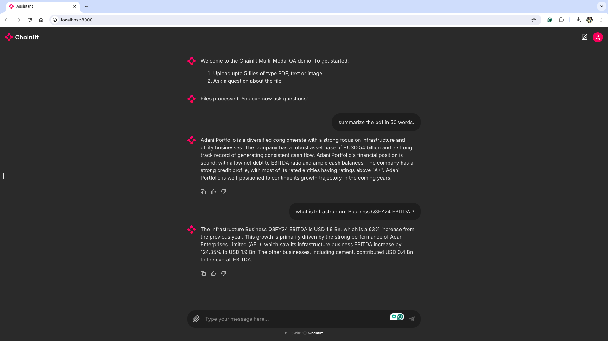

# Multi-Modal RAG Agent for Financial Analysis

This repository hosts a project that leverages LLMs to create a Multi-modal Retrieval-Augmented Generation (RAG) agent. This agent uses Google Gemini models, Vertex AI embeddings, Vertex AI SDK, LangChain, and Chainlit to deliver sophisticated financial analysis and investment advice based on user queries and provided documents.

## Overview

The Multi-Modal RAG Agent is designed to function as a financial analyst, answering user queries with detailed investment advice. It combines multiple modalities and AI capabilities to interpret and analyze financial documents, containing texts, images and tables, providing responses that are both informed and contextually relevant.


### Key Features

- **Google Gemini Models**: Utilizes Gemini family from Google AI for high-quality text and image processing.
- **Vertex AI Embeddings**: Embeds textual data for efficient retrieval and contextual understanding.
- **Vertex AI SDK**: Facilitates seamless access to Gemini models and Vertex AI services.
- **LangChain Integration**: Chains together various AI modules and models to create a coherent analysis pipeline.
- **Chainlit UI**: Provides an interactive user interface for querying the agent and receiving advice.

## RAG on Tables, Images and Texts [[Source](https://blog.langchain.dev/semi-structured-multi-modal-rag/)]
LangChain provides **multi-vector retriever** which allows us to decouple documents, which we want to use for answer synthesis, from a reference, which we want to use for retriever. Quoting LangChain, using this we can create a summary of a verbose document optimized to vector-based similarity search, but still pass the full document into the LLM to ensure no context is lost during answer synthesis. This approach is useful beyond raw text, and can be applied generally to either tables or images to support RAG.

[](https://blog.langchain.dev/content/images/size/w1600/2023/10/image-22.png)

There are at least three ways to approach the problem, which utilize the multi-vector retriever framework as discussed above:

1. Use multimodal embeddings (such as CLIP) to embed images and text together. Retrieve either using similarity search, but simply link to images in a docstore. Pass raw images and text chunks to a multimodal LLM for synthesis.

2. Use a multimodal LLM (such as GPT4-V, LLaVA, or FUYU-8b) to produce text summaries from images. Embed and retrieve text summaries using a text embedding model. And, again, reference raw text chunks or tables from a docstore for answer synthesis by a LLM; in this case, we exclude images from the docstore (because it's not feasibile to use a multi-modal LLM for synthesis).

3. Use a multimodal LLM (such as GPT4-V, LLaVA, or FUYU-8b) to produce text summaries from images. Embed and retrieve image summaries with a reference to the raw image, as we did above in option 1. And, again, pass raw images and text chunks to a multimodal LLM for answer synthesis. This option is sensible if we don't want to use multimodal embeddings.

We are using option 2 in this project making use of Gemini pro text and vision models to generate text and image summaries.


## Getting Started

### Prerequisites

- Python 3.9+
- Google Cloud SDK installed and configured.
- Google Cloud account with Vertex AI enabled
- API keys for Vertex AI
- Access to Gemini models
- Docker installed.

<!--- ### Installation

1. **Clone the repository**:
   ```bash
   git clone https://github.com/yourusername/financial-analyst-rag-agent.git
   cd financial-analyst-rag-agent
    ```

1. **Install dependencies**:
   ```bash
   git clone https://github.com/yourusername/financial-analyst-rag-agent.git
   cd financial-analyst-rag-agent
    ```
!--->

## ToDo:

1. Set Up Google Cloud Credentials Locally:
```
gcloud auth application-default login
```
This will open a browser window for authentication. After completion, credentials will be stored in ~/.config/gcloud/application_default_credentials.json.

2. Clone the repository:
```
git clone https://github.com/yourusername/multi-modal-rag.git
cd multi-modal-rag
```
3. Create the .env File
```
PROJECT_ID=your-google-cloud-project-id
REGION=project-region
CHUNK_SIZE=1000
CHUNK_OVERLAP=100
```

4. Build and run the Docker container:
```
docker-compose up --build
```

5. Open the Application:
```
http://localhost:8000
```
6. Upload Files and Ask Questions:

- Upload up to 4 files (PDF, text, or image).
- After uploading, ask questions about the content of the files, and the application will provide answers.

